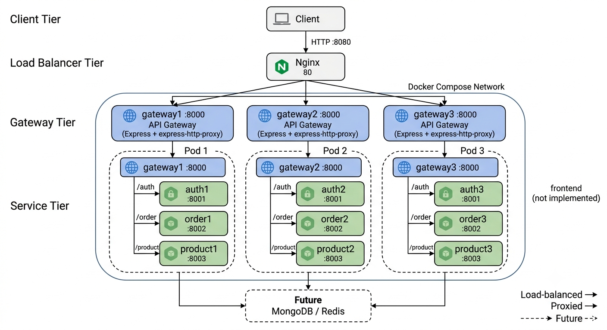

# System Design — Microservices Learning Project

A system design learning project: a monolith refactored into **3 pods**, each with an **API Gateway + its own copy of 3 services (auth, order, product)**, load-balanced by **Nginx**, run with **Docker Compose**.



## Architecture

- Nginx round-robins to gateway1/2/3
- Each gateway proxies `/auth`, `/order`, `/product` to **its own** copies of the services (pod isolation)

## Repos / Folders

- `phase1/` — the original monolith (Express + MongoDB Atlas + Redis)
- `phase2/` — the microservices refactor (gateway + services, this project)

## Run (phase2)

```bash
cd phase2
docker compose up --build
```

Test:

```bash
curl http://localhost:8080/          # alternates between the 3 gateways
curl http://localhost:8080/auth
curl http://localhost:8080/order
curl http://localhost:8080/product
```

Stop:

```bash
docker compose down
```

## Ports

| Container | Internal | Host |
|---|---|---|
| nginx | 80 | 8080 |
| gateway1/2/3 | 8000 | 8001/8002/8003 |
| auth1/2/3 | 8001 | 5001/5002/5003 |
| order1/2/3 | 8002 | 5004/5005/5006 |
| product1/2/3 | 8003 | 5007/5008/5009 |

Entry point: `http://localhost:8080`

## Notes

- Services are currently stubs (`GET /` health check) — business logic not yet migrated from Phase 1
- No database or Redis yet; no auth/JWT yet
- Proxy targets use Docker container names, so they only resolve inside Compose